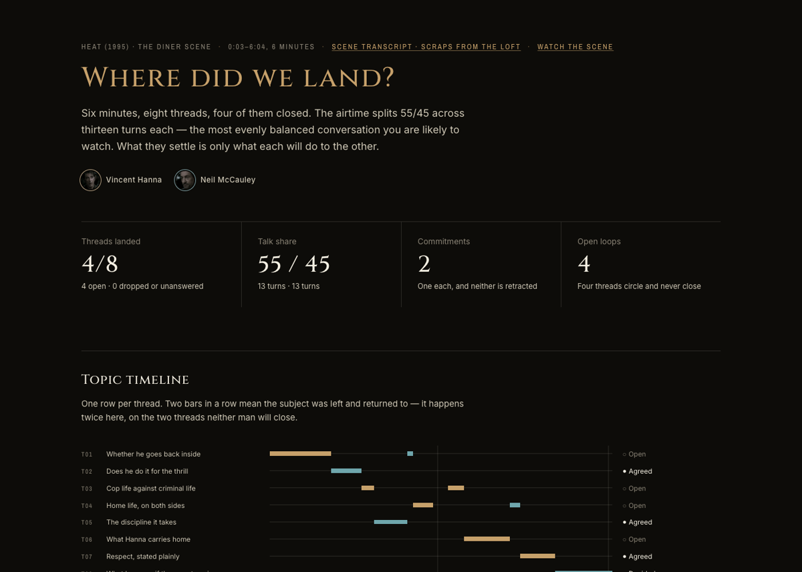

# Where Did We Land?

Turns a meeting transcript into one self-contained HTML file: topic timeline, a ledger of where every
thread landed with the quote that proves it, open loops, commitments, stances, and airtime.

Plain HTML on disk. No publishing, no hosting, no server, no build step, no dependencies — open it by
double-clicking, mail it, drop it in a repo. The only capability the skill needs is file read/write.

```
/where-did-we-land ~/Downloads/product-sync.txt
→ ~/Downloads/product-sync-ledger.html
```

## See one

[](https://gnurio.github.io/where-did-we-land/heat.html)

A live page, unedited output: **[the diner scene from Heat
(1995)](https://gnurio.github.io/where-did-we-land/heat.html)**. Two men who intend to kill each
other split the airtime 55/45 across thirteen turns each and settle four threads out of eight — the
best-balanced and least conclusive conversation you will ever watch. At the foot of that page is a
seventy-four-second video of the scene playing with the ledger assembling beside it.

That page is skinned in a noir palette taken from the film's posters, which is a per-page
override — every other ledger the skill writes still comes out light.

## Install

**One command, any agent:**

```bash
npx skills add gnurio/where-did-we-land
```

**Claude Code** — as a plugin:

```
/plugin marketplace add gnurio/where-did-we-land
/plugin install where-did-we-land
```

**Manually**, in any harness. The skill folder is self-contained — `SKILL.md`, its `reference/` and
its `scripts/` travel together — so copying it is a complete install:

```bash
git clone https://github.com/gnurio/where-did-we-land.git /tmp/wdwl
cp -R /tmp/wdwl/skills/where-did-we-land <target-below>
```

| Harness | Personal | Project |
|---|---|---|
| Claude Code | `~/.claude/skills/` | `.claude/skills/` |
| Cursor | `~/.cursor/skills/` | `.cursor/skills/` |
| Codex CLI | `~/.agents/skills/` | `.agents/skills/` |
| Copilot (VS Code) | `~/.copilot/skills/` | `.github/skills/` — also reads `.claude/skills/` and `.agents/skills/` |

Cowork: upload the `skills/where-did-we-land/` folder and reference `SKILL.md` in the prompt.

## Getting a transcript in

Run it with no argument and it goes looking. 

| # | Rung | Needs |
|---|---|---|
| 1 | **Explicit input** — a path, a share URL, or pasted text | nothing |
| 2 | **Local disk sweep** — `~/Downloads`, `~/Documents/Zoom`, a synced `Meet Recordings/`, recognising Zoom's `GMT…transcript.vtt` and Teams' `.vtt` alongside its `.docx` | filesystem |
| 3 | **A share link** — Otter, Fathom, Grain, tl;dv pages are usually public and fetchable | web fetch |
| 4 | **MCP adapters** — Granola meetings, Google Drive for Meet transcript Docs, Gmail for notetaker recap emails | that MCP |
| 5 | **Ask** — labels what it already checked | — |

`skills/where-did-we-land/reference/sources.md` contains the filename patterns, which links require authentication (Zoom share links and
SharePoint are — ask for the `.vtt`), and the exact MCP searches.

### Formats it accepts

All the meeting tools use one of five shapes. `skills/where-did-we-land/reference/formats.md`
contains the detection and normalisation rules.

| Shape | Looks like | From |
|---|---|---|
| Speaker-header block | `Thor Galle 0:49` then the speech below | **Otter**, Google Meet Docs, Descript |
| WebVTT | `00:00:05.790 --> …` then `Christina: …` or `<v John Smith>…</v>` | **Zoom**, **Teams**, Avoma, Grain |
| SRT | same cues, comma decimals | Otter, Fireflies, Grain, Descript |
| Inline label | `[00:05:32] Alice: …` or `**Sarah (00:00):** …` | Granola exporters, Fireflies MD, tl;dv, Krisp |
| JSON | `{"speaker":…,"text":…,"start_time":…}` | Granola, Fathom, Circleback, Fireflies, Read.ai APIs |

**Caveat:** VTT, SRT and per-utterance JSON files create a cue every few seconds. This means a 400-word monologue can be sent as forty separate entries.
You must merge these entries into turns first. Otherwise, the turn count will increase 10 to 20 times. This will make the airtime chart inaccurate.
The system self-verifies. A 20-minute conversation between two people should have about 40 to 120 turns.

**Rejected outright:** Teams plain-text via Graph (strips speaker attribution entirely — ask for the
`.vtt`), Granola "Copy Notes" (copies the summary, not the transcript), Supernormal imported
recordings (monologue-formatted, no speaker separation).

### The single-speaker check

Solo voice notes have no stances, agreements, or open loops between people. The skill stops and offers a summary instead of rendering a page that implies a meeting happened. This is most important when running unattended.

## Running it automatically

There is no built-in hook — Granola has no local file to watch. Wire it as a scheduled agent that
polls for new meetings:

```
/schedule create "Every weekday at 6pm, list Granola meetings from today.
  For each one with two or more speakers who take turns, run the
  where-did-we-land skill and write the .html into ~/Meetings/ledgers/.
  Skip single-speaker voice notes silently. Report only the file paths."
```

## Other notes

The generated file retains **word counts, not words**. `turns` carries
`[speaker, seconds, wordCount]`, so the charts and talk share are exact while the transcript itself
never leaves your machine. The only verbatim text on the page is the handful of quotes chosen as
receipts — typically a dozen or two lines out of several thousand words.

This matters if you wish to share the generated artifact with others.

## Files

- `skills/where-did-we-land/SKILL.md` — the procedure
- `skills/where-did-we-land/template.html` — the page; renders from the JSON block at its top
- `skills/where-did-we-land/reference/formats.md` — the five transcript shapes, and the merge rule
- `skills/where-did-we-land/reference/sources.md` — the acquisition ladder
- `skills/where-did-we-land/scripts/check_ledger.py` — structural checks on any generated ledger
- `evals/` — trigger and behaviour scenarios (maintainers; not needed to use the skill)

## Checking a ledger

```bash
python3 skills/where-did-we-land/scripts/check_ledger.py out-ledger.html [transcript.txt]
```

Asserts that no transcript leaked, that the turn count is plausible for the duration (an unmerged VTT
fails loudly here), that every thread carries a state and a receipt, that every unresolved thread
reached the open-loops table, and that the timeline geometry is sane. Pass the source transcript too
and it also confirms every quote appears verbatim — the one check that catches an invented receipt.

Exits non-zero on failure.

## Editing the look

Colour lives in the `:root` custom properties at the top of `skills/where-did-we-land/template.html`. Speakers draw from
`--indigo` then `--ink-dark`; `--teal-text` marks landed threads, `--muted` open, `--ink` dropped.
Light mode only, by design. Type is Sora for display and Inter for everything else, loaded from Google
Fonts with a system-grotesque fallback — the page renders correctly offline, just without Sora.

All text colours are checked against the 4.5:1 floor on white. If you swap the palette, re-check:
the design-system muted grey `#868A97` measures 3.44:1 and fails, which is why the text step is
`#626673`.

## Get in touch

A transcript format it mangles, or a meeting it read wrong, is the most useful thing you can send.
[Open an issue](https://github.com/gnurio/where-did-we-land/issues) — six of the open ones are
blocked on a real export file from a tool nobody has handed over yet, so an anonymised sample from
Zoom, Teams, Meet or Granola unblocks one outright. Otherwise: [github.com/gnurio](https://github.com/gnurio).

